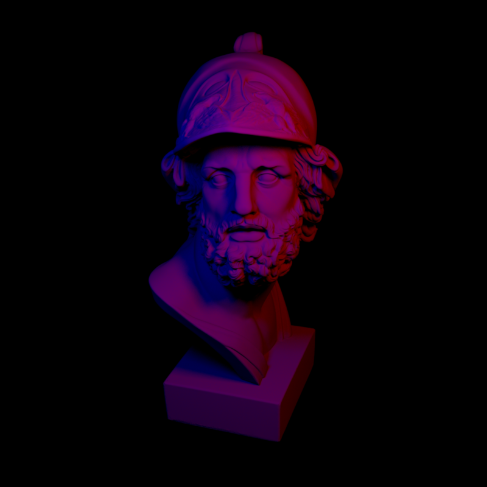

## Whats This?
Here I show my implementation of the Nori renderer, an educational ray tracer based on the [Advanced Computer Graphics](http://rgl.epfl.ch/courses/ACG20) 
course of [EPFL](https://www.epfl.ch/en/). An introduction and the assignments are found [here](https://wjakob.github.io/nori/) 
and the Github repository where my Code originates from is found [here](https://github.com/wjakob/nori).

Huge shoutout to Wenzel Jakob and his team for providing such a great framework for learning. Please note, that most of 
code here originates from [their repository](https://github.com/wjakob/nori). 

## Disclaimer
I do not give any warranty that my code is correct. This is just an CG enthusiast trying to improve rendering skills. 
If you notice any mistakes in my code feel free to point them out to me.

## What I have done so far
Currently I finished all assignments up to pa4. This means I implemented an acceleration structure (BVH) to improve 
intersection of rays with the scene, added sample warping for several distributions and implemented distributed and 
Whitted style ray tracing. 

## Results
Here you see some images I rendered.

The original Cornell box from the course.

A Cornell box inspired scene I created mainly to see how to export blender scenes into Nori. 

The ajax bust from the early assignments with two area lights.