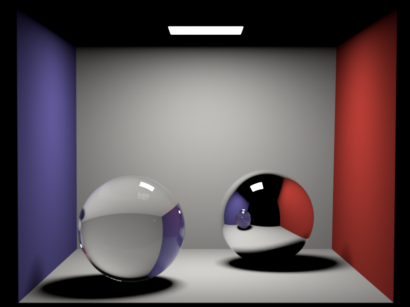
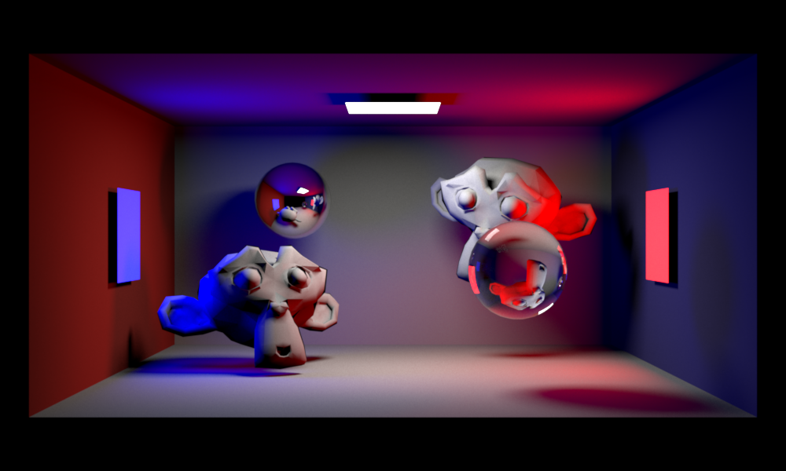
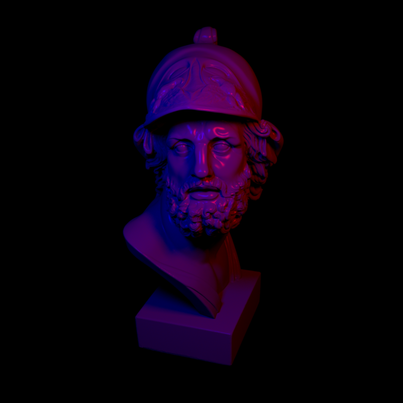
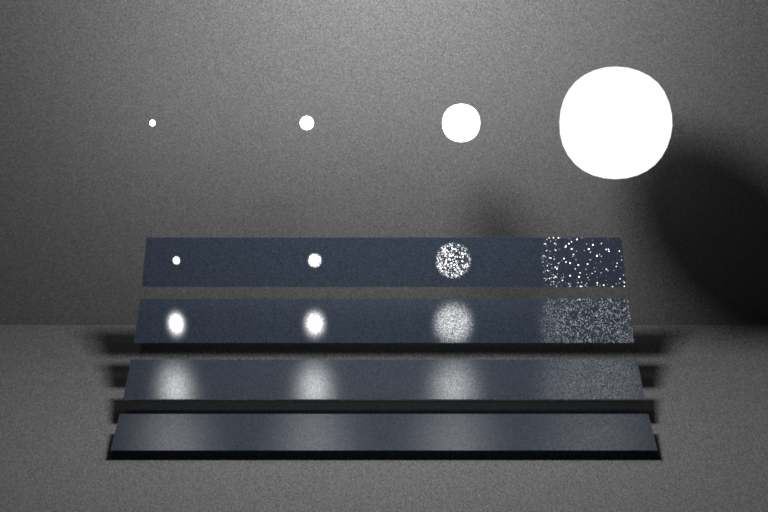
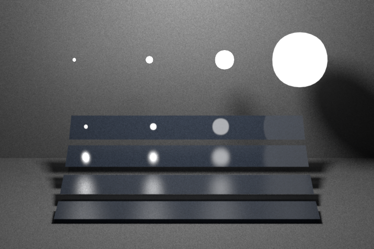
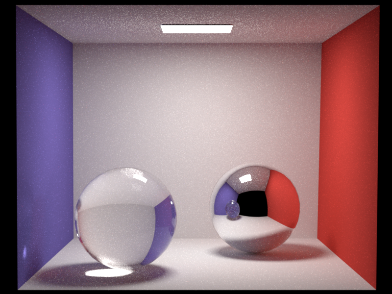

## Whats This?
Here I show my version of the Nori renderer, an educational ray tracer based on the [Advanced Computer Graphics](http://rgl.epfl.ch/courses/ACG20) 
course of [EPFL](https://www.epfl.ch/en/). An introduction and the assignments are found [here](https://wjakob.github.io/nori/) 
and the Github repository where my Code originates from is found [here](https://github.com/wjakob/nori).

Huge shoutout to Wenzel Jakob and his team for providing such a great framework for learning. Please note, that most of 
code here originates from [their repository](https://github.com/wjakob/nori). 
The framework basically provides most functionality of a CPU renderer and lets you implement key features like sampling and path tracing.

## Disclaimer
I do not give any warranty that my code is correct. This is just a CG enthusiast trying to improve rendering skills. 
If you notice any mistakes in my code feel free to point them out to me.

## What I have done so far
I finished all assignments up to pa5. This means I implemented an acceleration structure (BVH) to improve 
intersection of rays with the scene, added sample warping for several distributions, implemented distributed and 
Whitted style ray tracing and in the last step added path tracing, first only with next event estimation and then with multiple importance sampling.
I leave the "hacker assignments" open for now.

## Results
Here you see some images I rendered.

 \
The original Cornell box from the course with a Whitted-style raytracer. \
\
 \
A Cornell box inspired scene I created mainly to see how to export blender scenes into Nori. Also rendered with Whitted-style raytracing.

Ajax rough          |  Ajax smooth
------------------------|-------------------------
 | 
 rough (a = 0.28) | smooth (a = 0.08)
 
 The ajax bust from the early assignments with two area lights.
 
 \
Iconic scene from the Veach paper about multiple importance sampling rendered with next event estimation (NEE).
 
 \
The same scene rendered with multiple importance sampling (MIS).

 \
The Cornell box scene, now path traced with MIS.
