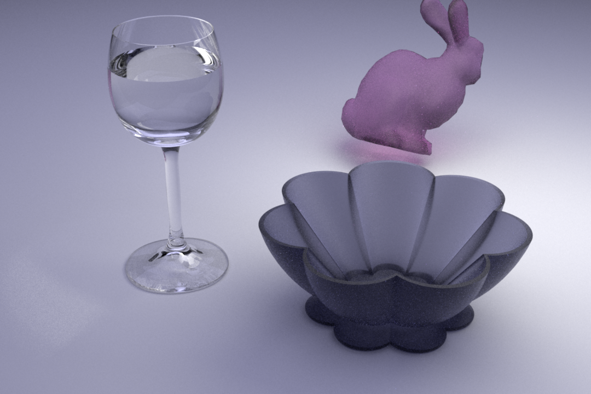

## Nori Microfacet Dielectric BSDF
I implemented a microfacet dielectric bsdf with GGX distribution based on the implementation of cjsb/nori-2 and the Nori renderer, an educational ray tracer based on the [Advanced Computer Graphics](http://rgl.epfl.ch/courses/ACG20) course of [EPFL](https://www.epfl.ch/en/). The mircrofacet dielectric bsdf is a hacker assignment in the course.
An introduction and the assignments are found [here](https://wjakob.github.io/nori/) and the Github repository of the code is found [here](https://github.com/wjakob/nori). csjb's nori-2 code base can be found [here](https://github.com/cjsb/nori-2).

## Results
Here are some images I rendered.

 \
The microfacet dielectric Cornell box rendered with a MIS-style path tracer.

 \
The microfacet dielectric Table with an additional microfacet dielectric bunny rendered with a MIS-style path tracer. The image is processed with a simple filter to clamp down outliers(fireflies).